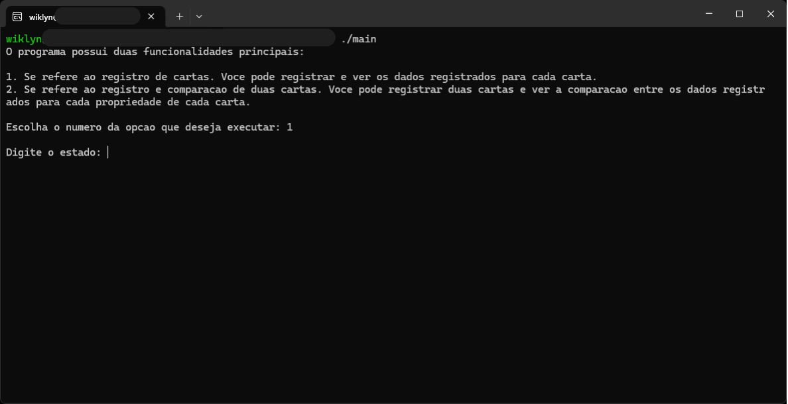
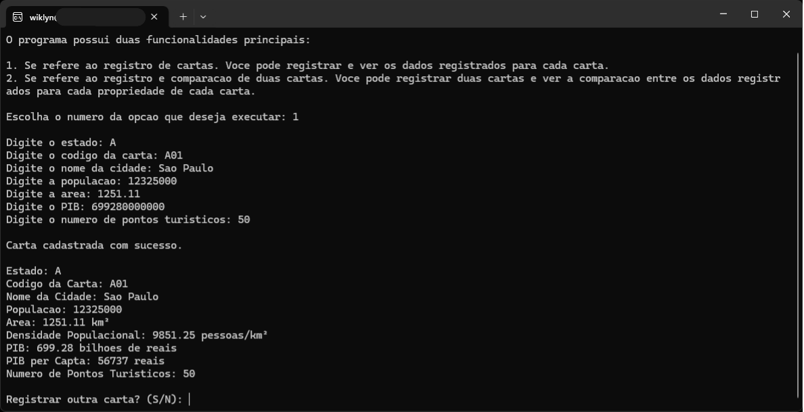
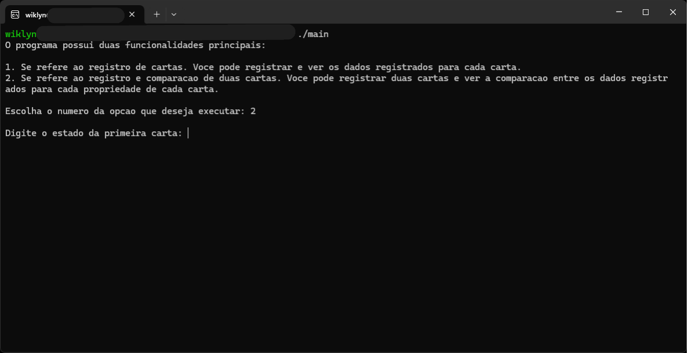
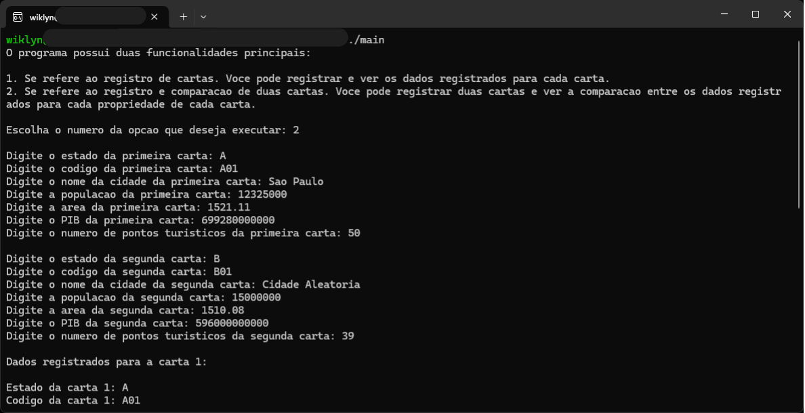
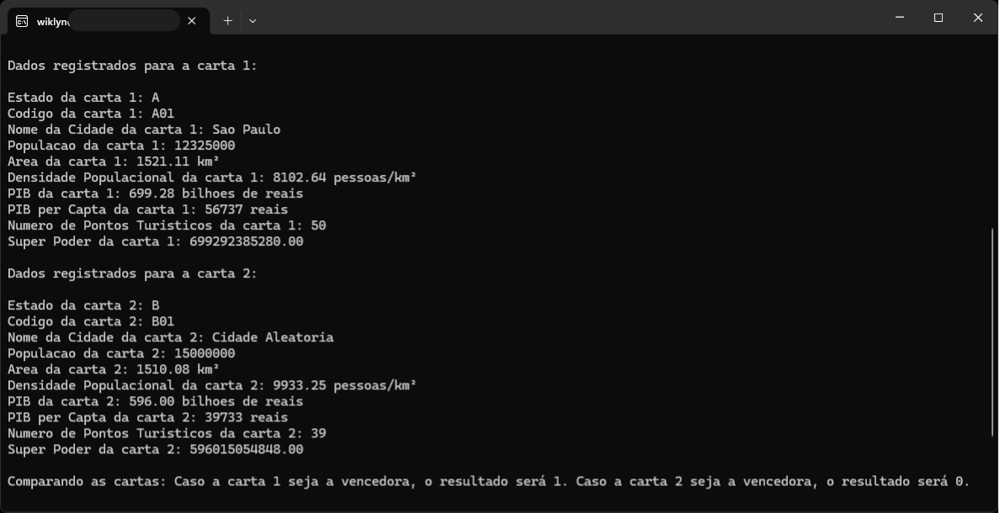
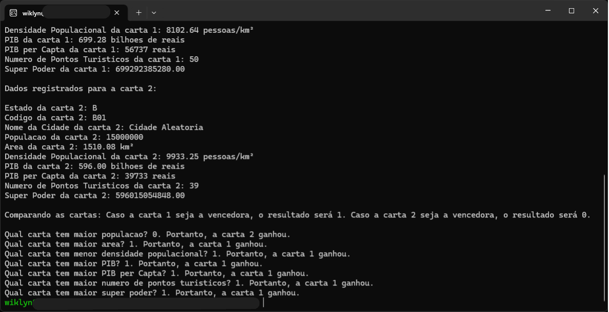

# Documentação

Eu alterei a estrutura do projeto e utilizei de conceitos dos quais eu já possuo
conhecimento, mas ainda não foram ensinados na disciplina. Caso isso seja um
problema, eu reescreverei o projeto.

Apesar do uso de *overengineering*, achei que essa seria uma boa oportunidade
para praticar alguns assuntos que estudei anteriormente.

## Estrutura do Projeto

O projeto segue a seguinte estrutura de diretórios:

```bash
.
├── README.md           # Documentação do projeto
├── apps
│   └── main.c          # Arquivo principal com a função `main`
├── include             # Arquivos de cabeçalhos contendo as declarações das funções
│   ├── card.h
│   ├── city.h
│   └── interface.h
└── src                 # Arquivos de implementação das funções declaradas nos cabeçalhos
    ├── card.c
    ├── city.c
    └── interface.c
```

---

### NOTA

**Essa estrutura foi baseada na estrutura utilizada pelo professor Samuel
Martins no curso [Dominando Estruturas de Dados 1](https://github.com/xavecoding/dominando-estruturas-de-dados-1).
O uso de ponteiros, das funções `calloc` e `free`, da estrutura de dados
`struct`, de *include guards* e qualquer outro tema que não tenha sido abordado
na disciplina "Introdução à Programação de Computadores", foi aprendido no curso
mencionado. A excessão é o uso da documentação Doxygen, que eu aprendi enquanto
resolvia este desafio.**

## Detalhes de implementação

O programa possui dois fluxos principais:

1. **Registro de cartas:**

   Neste fluxo, o usuário pode registrar os dados de cidades e visualizar as
   informações cadastradas logo após cada registro.

   - O número máximo de cidades que podem ser cadastradas é **32**,
   correspondente à quantidade de cartas no jogo original.
   - As cidades são armazenadas em uma lista de ponteiros chamada `city_list`,
   que é alocada na memória estática.
   - Cada elemento dessa lista é um ponteiro para uma estrutura do tipo `City`,
   que é alocada dinamicamente na memória heap à medida que o usuário cadastra
   novas cidades.
   - A estrutura `City` organiza os dados de cada cidade, incluindo:
     - Estado.
     - Código da carta.
     - Nome da cidade.
     - População.
     - Área.
     - Densidade populacional: calculada como a razão entre População e Área.
     - PIB.
     - PIB per capita: calculado como a razão entre PIB e População.
     - Número de pontos turísticos.
     - Super poder: calculado como a soma do inverso da densidade populacional
       com todas as outras propriedades de valores numéricos.

2. **Registro e comparação de duas cartas:**

   Neste fluxo, o usuário registra os dados de duas cartas conforme solicitado
   pelo programa. Ao final, é exibido o resultado da comparação de cada uma das
   propriedades numéricas das cartas.

### Compatibilidade

Na exibição dos dados, caracteres que podem não ser interpretados corretamente
em todos os terminais (como acentos ortográficos) foram removidos para garantir
a compatibilidade.

## Compilação

O comando usado para compilar foi:

```bash
gcc apps/CartasSuperTrunfo.c -o CartasSuperTrunfo src/*.c -I include
```

Explicação:

- `gcc`: Compilador utilizado.
- `apps/CartasSuperTrunfo.c`: Arquivo principal com a função main.
- `-o CartasSuperTrunfo`: Nome do executável gerado.
- `src/*.c`: Arquivos com a implementação das funções declaradas nos cabeçalhos.
- `-I include`: Diretório que contém os arquivos de cabeçalho.

Você precisa especificar os arquivos ou diretórios necessários durante a
compilação para garantir que todas as dependências sejam incluídas.

## Funcionamento do projeto

O fluxo básico de interação com o usuário segue as etapas abaixo:

1. O programa pergunta ao usuário qual fluxo ele deseja executar:

    

    Caso o usuário insira um valor inválido ao escolher o fluxo, uma mensagem
    será exibida informando que o valor inserido é inválido e solicitando um
    novo valor. Isso se repetirá até que o usuário insira uma opção válida.

2. O usuário escolhe qual fluxo deseja executar.

    2.1 - Caso o fluxo escolhido seja o fluxo de registro de cartas, as
    propriedades da primeira carta serão solicitadas uma a uma:

    

    

    Em seguida, o programa pergunta se o usuário deseja registrar outra carta.

    - Se o usuário inserir um valor inválido nesta etapa, o programa exibirá uma
    mensagem informando o erro e pedindo um valor válido. Isso se repetirá até
    que o usuário forneça uma resposta válida.
    - Se a resposta for positiva, o processo se repete até que o limite máximo
    de 32 cartas seja atingido. Nesse caso, o programa exibe a mensagem
    **"Número máximo de cartas atingido."** e termina sua execução.
    - Se o usuário optar por não cadastrar mais cartas antes de atingir o
    limite, o programa também encerra sua execução.

    ---

    2.2 - Caso o fluxo escolhido seja o fluxo de registro e comparação de
    cartas, as propriedades da primeira e segunda cartas serão solicitadas uma a
    uma:

    

    

    Após receber os dados, o programa exibe os dados registrados e calculados
    para cada carta:

    

    Em seguida, o programa realiza e exibe a comparação dos valores numéricos
    entre as duas cartas:

    

    Após apresentar os resultados da comparação, o programa encerra sua
    execução.
